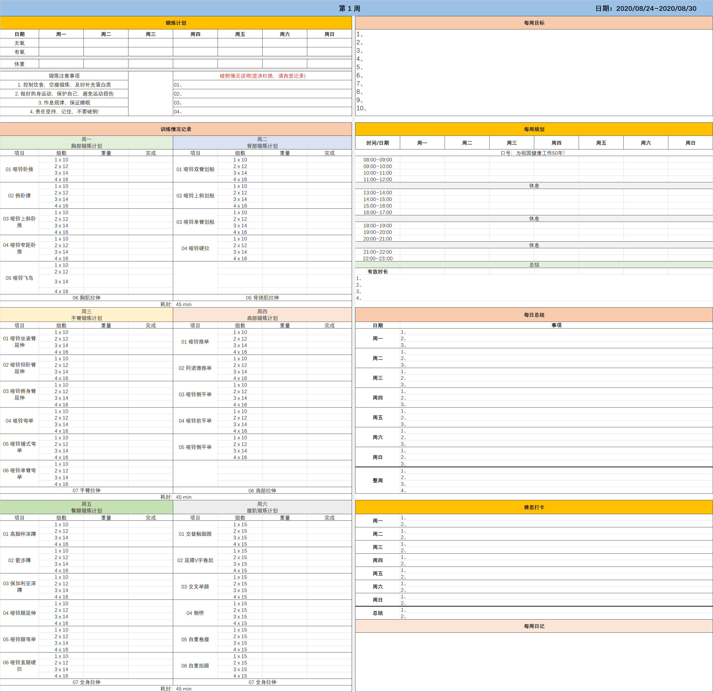
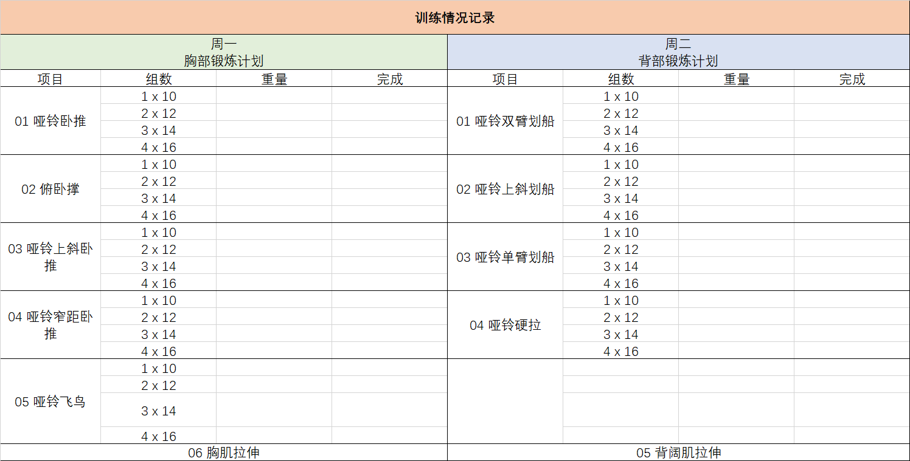
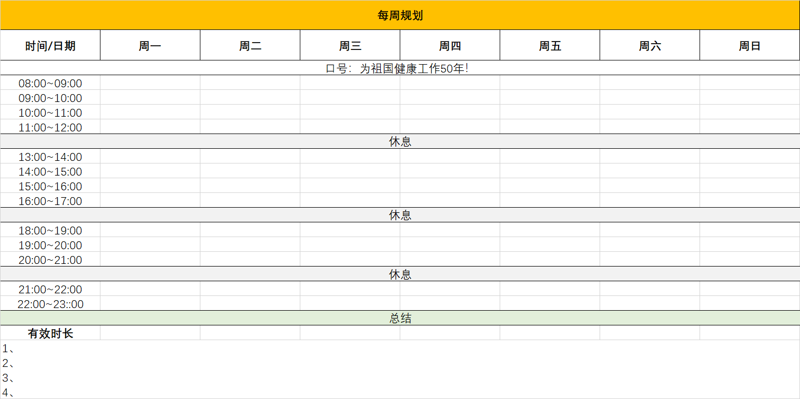
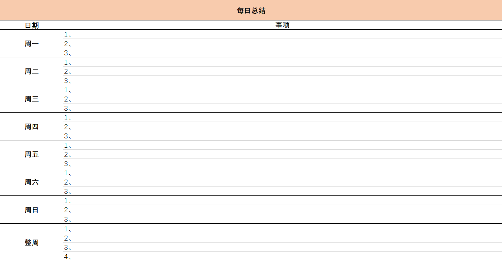
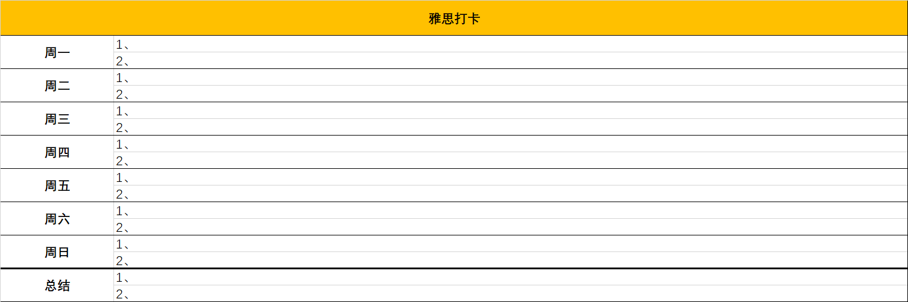
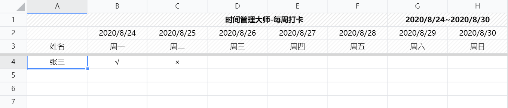

# 时间管理大师

## 前言

俗话说，“就是有九十九个困难，只要有一个坚强的意志就不困难”，但是，身为凡人的我们，大多数没有如此大毅力，但更多的时候，其实是我们不得法。有人说，我就是静不下心来，好，我帮你分析下原因，我把努力分为以下几种：

- “**休闲式”努力**：三天打鱼、两天晒网；
- **“放弃式”努力**：今天定下目标，执行一周就放弃；
- **“自我感动式”努力**：好像很用功，其实三心二意，感动自己，比如在课堂上不听课，下了课不做笔记，不做总结；
- “**瞎”努力**：努力没有目标、执行没有计划，以备考雅思为例，你今天背一下词汇、明天看下语法、后天做下题、不抓重点、不做总结、不成体系，这样的努力，雅思成绩就很难有所提升。

请你看看自己是哪种，然后根据原因去调整自己努力的状态。当然，这个项目的意义在于帮助你做到自律！所以，下面我们提供你做到高效自律的“武功秘籍”！

---

## 计划表

那么如何做到高效的时间管理！这里有份EXCEL表格要送给你。推荐的一个任务执行周期是2周，1周太短，1个月太长（也有个拌饭是，你感觉状态不好了就做个总结）。通过这份表格，只要你每天像我一样，定制自己的规划、去执行、最后打卡、做总结！相信你也一定可以实现自己的目标的！

|         目标         | 完成 |
| :------------------: | :--: |
|      1、雅思7.0      |  √   |
| 2、2周体重下降到70kg |  √   |

---

具体的，它长这样，完整的：

---

---

---

---

---

---

## 励志

在成功的道路上，难免灰心，难免偷懒（身为凡人），我分享一些经验，我就常问自己以下几个问题：

- 我有人家聪明嘛？没有人家聪明，你就多付出点努力！
- 我有人家努力嘛？没人家聪明，还没人家努力，你想干什么！
- 我比人家笨嘛？不比人家笨，为啥别人行你不行？
- 别人能做、为什么我不能做？都是一个鼻子、一张嘴巴，比你多手了？为啥你不行。
- 我还能不能做更好？天才是要做到卓越的。
- 成年人的世界哪有我已经努力了，谁会记得第二名？多付出点吧，兄弟，失败哭的时候，你才知道眼泪有多苦。
- 不要害怕失败，我宁愿付出了努力，最后不幸失败了，也不愿像只乌龟王八蛋一样缩在坑里不敢出去！
- 十几、二十几岁的时光，这段时光影响了你的事业选择、爱情走向、甚至整个人生，同时也拉开了你与别人之间的差距。
- 你不吃学习的苦，就要吃更多生活的苦。
- 愚蠢的人总是浪费机会，聪明的人把握机会，真正的天才创造机会。

当然，人和人之间，天分、悟性、毅力、条件方方面面都会有差距，我们要正确地看待这些差距，保持平常心，好好去努力。有些时候成功，运气的成分也有一些，那么生而为人，我们就只能通过努力把这种运气的因素降到最低！

---

还有句不好听的话：千万不要**自我感动**！其实大部分人看似的努力实际上都是愚蠢导致的，什么熬夜看书到天亮，几天只睡几个小时，好久不放假了，如果这些东西也值得炫耀，那富士康流水线上任何一个员工都比你努力多了。人难免有自怜的情绪，唯有时刻保持清醒，才能找准自己的价值。

别自我感动，你看看身边哪个人不是在努力？你有人家努力嘛？就算有，你有人家聪明嘛？所以少年，站起来，尽自己全力干就完了，别问值不值！别问可不可能！按计划走！努力！达到！

---

## 娱乐

关于娱乐，有一点，一天，你一定要有休息时间，比如睡个午觉、看会东西，一周你也一定要有个休息时间，比如周五晚上早点回去，比如8点就回宿舍，去跑个步、洗个澡！其实，很多时候，人只有在自由中才能明了自己内心真正的渴望，玩学兼顾都要尽兴或许是最好的状态。Please，Just 相信我！我们是凡人！那2、3个小时的时间绝对花得“物超所值”！

---

## 打卡

打卡链接：

1. [每周打卡：2020.08.26~2020.08.30](https://docs.qq.com/sheet/DZlJ6b2lIZ1hjamhW)

---

最后，也祝我，也祝君们，都能实现自己的理想与抱负！

姓名：FLYMAN

邮箱：fly_cjb@163.com

> 至于这份表格的来由，主要是，硕士期间的浑浑噩噩导致我错过各种机会，一无所成，经过深刻反思，总结出，我并不是不努力，而是一直在“无目标”努力，于是就有了这份表格。

